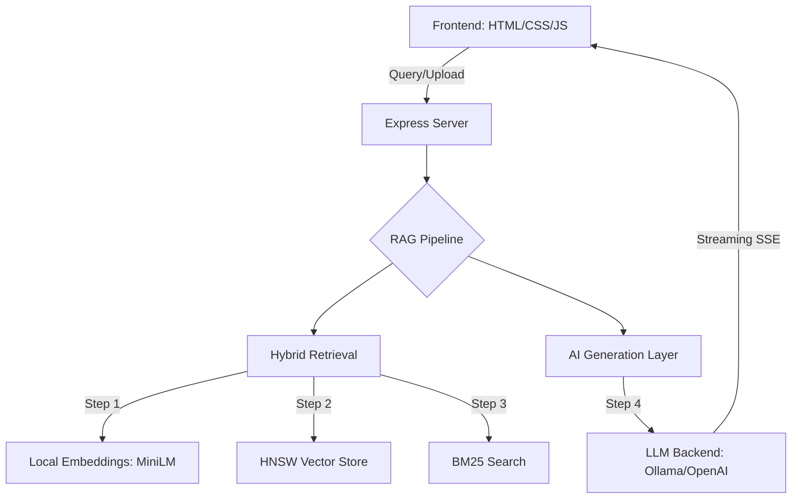

# 🚀 Tech Spark Academy — RAG Intelligence Engine


**Tech Spark Academy RAG** is a high-performance **Retrieval-Augmented Generation (RAG)** system designed for real-time, multi-language code intelligence. It allows users to upload source code files, build a searchable knowledge base, and query an AI assistant that provides context-aware answers, code explanations, debugging help, optimization suggestions, and code generation — all through a stunning, modern web dashboard.

---

## ✨ Key Features

-   🧠 **Hybrid Retrieval**: Combines Vector search (HNSW) and BM25 keyword search with Reciprocal Rank Fusion (RRF) for ultimate accuracy.
-   🔢 **Local Embeddings**: Uses `@xenova/transformers` to run `all-MiniLM-L6-v2` entirely on your machine.
-   🤖 **AI Intelligence**: 5 specialized modes (Answer, Explain, Debug, Optimize, Generate).
-   ⚡ **Near-Zero Latency**: Search results in < 20ms and real-time SSE streaming for responses.
-   🎨 **Premium Dashboard**: Professional dark theme with glassmorphism, smooth animations, and real-time latency tracking.
-   📥 **Smart Ingestion**: Automatic chunking and language detection for **30+ programming languages**.
-   🔐 **Privacy First**: Everything runs locally — your code never leaves your network.

---

## 🏗️ Architecture



---

## 🛠️ Technology Stack

| Layer | Technology |
| :--- | :--- |
| **Runtime** | Node.js (ES Modules) |
| **Framework** | Express.js |
| **Embeddings** | @xenova/transformers (all-MiniLM-L6-v2) |
| **LLM Backend** | Ollama + DeepSeek Coder 1.3B |
| **Frontend** | Vanilla HTML5 / CSS3 / JavaScript |
| **Styling** | Custom Premium CSS (Glassmorphism) |
| **Syntax Highlighting** | Prism.js |
| **Markdown** | marked.js |

---

## 🚀 Getting Started

### Prerequisites

1.  **Node.js** v18 or higher.
2.  **Ollama** installed and running.
3.  **DeepSeek Coder** model:
    ```bash
    ollama pull deepseek-coder:1.3b
    ```

### Installation

1.  **Clone the repository:**
    ```bash
    git clone https://github.com/your-username/tech-spark-academy-rag.git
    cd tech-spark-academy-rag
    ```

2.  **Install dependencies:**
    ```bash
    npm install
    ```

3.  **Configure Environment:**
    Create a `.env` file (or copy from `.env.example`):
    ```env
    PORT=3000
    OPENAI_BASE_URL=http://localhost:11434/v1
    OPENAI_MODEL=deepseek-coder:1.3b
    ```

4.  **Launch the application:**
    ```bash
    npm start
    ```

5.  **Access the Dashboard:**
    Open [http://localhost:3000](http://localhost:3000) in your browser.

---

## 📂 Project Structure

-   `server.js`: Main Express server and application entry point.
-   `src/`: Core logic modules (embeddings, vector store, retrieval, ingestion).
-   `public/`: Premium frontend assets (dashboard, styles, logic).
-   `data/`: Local vector storage and sample files.

---

## 📊 Performance Specifications

-   **Search Latency**: < 20ms
-   **Embedding Dimensions**: 384
-   **Context Window**: 2500 tokens
-   **Streaming Output**: Real-time via Server-Sent Events (SSE)

---

## 🔐 Security & Privacy

This project is built with a **local-first** philosophy. By default, it uses Ollama and local embedding models. No files or queries are sent to external servers unless you explicitly configure an external LLM provider like OpenAI.

---

## 📄 License

Distributed under the **MIT License**. See `LICENSE` for more information.

---

## 👨‍💻 Developed By

**Tech Spark Academy**
*"Intelligence at the speed of thought"*
